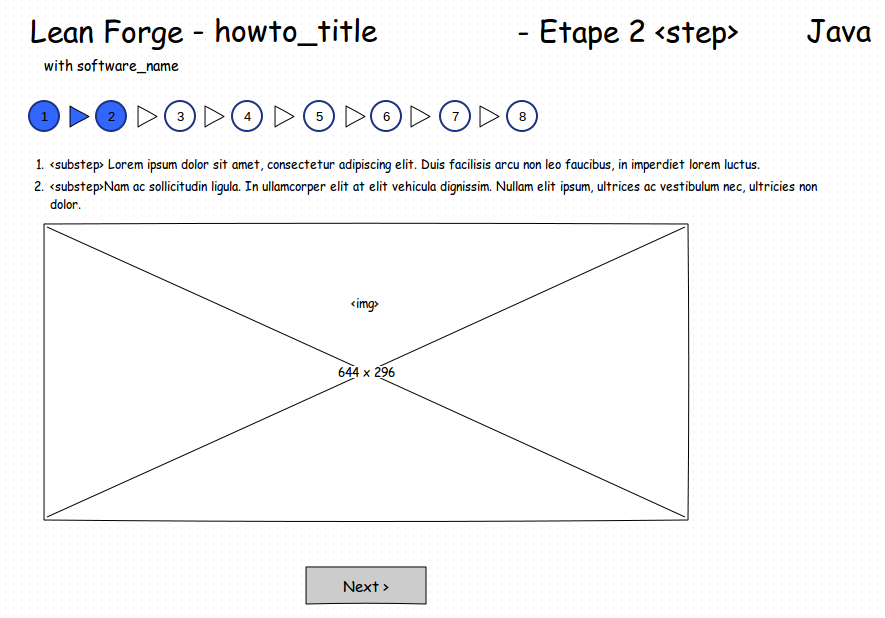
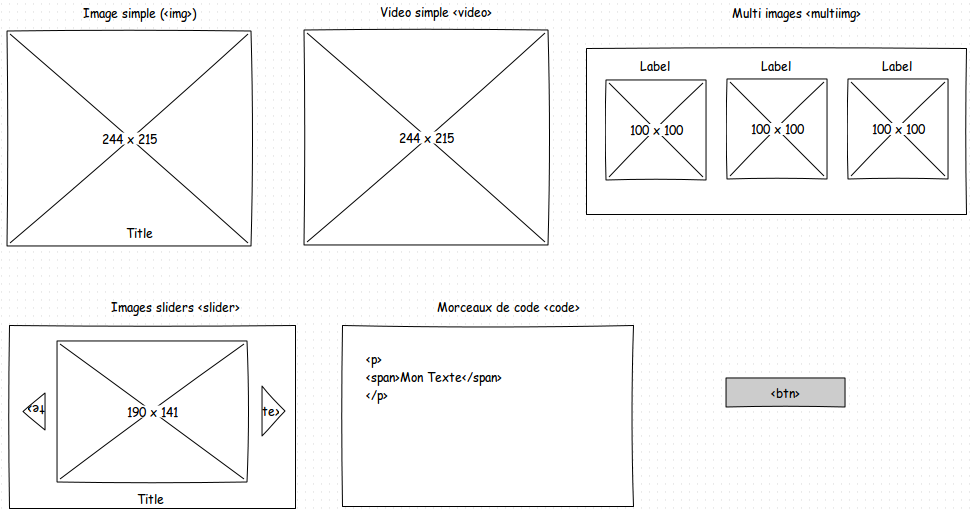

#Core Project Lean Forge

La plateforme Lean Forge apportera des atouts simples, accessibles et rapide pour avancer rapidement dans l'utilisation de logiciel d'aide au dévelopement. La plateforme s'articulera autour d'un site web.

##Maquette

Maquette réalisé avec Pencil : http://pencil.evolus.vn/Default.html  
Vous pouvez nous aider à améliorer les écrans existants faire des propositions avec Pencil.

* L'écran tutorial version 2 a été retenu.

##Fournir un tutoriel

Vous devrez fournir votre "tutoriel" au format XML qui respectera un format précis.
Ce format est définit dans un fichier de Schema XSD ([TutorialSchema.xsd](https://github.com/HugoPoi/LeanForge/blob/master/xsd/tutotialschema.xsd "Consulter le schema")). Vous pouvez consulter 2 exemples présent dans le [dossier doc](https://github.com/HugoPoi/LeanForge/tree/master/doc) `demo.xml` et `maven-installation.xml`.

* Chaque fichier correspond à un tutoriel exemple: Installation de Maven sous Windows = 1 fichier xml
* Le XML est divisé en 2 parties : `<meta>` => information générale, `<content>` => le contenu du tutoriel
* Les `<step>` correspondent à des pages générer dans l'ordre
* Les `<substep>` sont des sous-étapes qui sont situé sur la même page
* Vous pouvez intercalé des ``, `<slider>`, `<multiimg>`, `<code>`, `<video>`, `<btn>` entre les `<substep>`

* Vous pouvez valider votre XML via http://www.utilities-online.info/xsdvalidation/?save=9636daaf-1752-4ef2-994a-00a89c4b949d-xsdvalidation
* Le format gère le multi lang vous pouvez définir une balise `<content>` par langue (dans l'idéale fr-FR et en-US)
* Vous devez mettre votre contenu de type string dans des balises d'échappements : `<![CDATA[votre texte]]>`

##Intégration

Une beta du site est en cours de développement les sources sont dipo ici : https://github.com/HugoPoi/SemJavaWeb/tree/leanforge

##Liens utiles

* Documentation sur les schema XSD http://www.gchagnon.fr/cours/xml/schema.html
* Documentation implémentation JAXB2 http://mojo.codehaus.org/jaxb2-maven-plugin/usage.html
